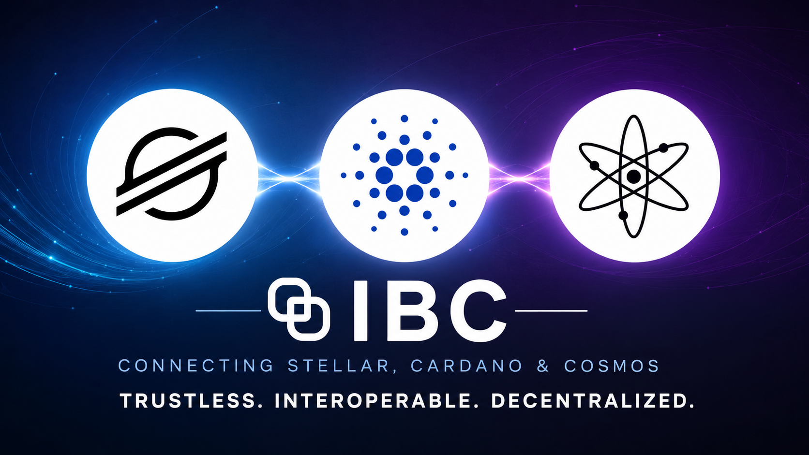

<p align="center">
  
</p>

# Stellar IBC Bridge

Rust implementation of IBC v2 (Eureka) for the Stellar network, enabling trustless
cross-chain communication between Stellar and Cosmos-compatible chains.

This repository is part of the **Cardano–Stellar IBC bridge** project. It provides the
gateway binary that the [Hermes relayer fork](../cardano-ibc-incubator/relayer/) talks to
when relaying IBC packets involving Stellar, and the `stellar-ibc` library that contains
the IBC protocol logic for Soroban contracts.

---

## Table of Contents

- [Overview](#overview)
- [Architecture](#architecture)
- [Repository Structure](#repository-structure)
- [gRPC API](#grpc-api)
- [HTTP API](#http-api)
- [Configuration](#configuration)
- [Running](#running)
- [Integration with caribic](#integration-with-caribic)
- [Development](#development)
- [Implementation Status](#implementation-status)

---

## Overview

**IBC version:** IBC v2 (Eureka) — no connection or channel handshake required.  
**On-chain runtime:** Soroban (Stellar's WebAssembly smart contract platform).  
**Relayer:** [Hermes fork](../cardano-ibc-incubator/relayer/) with a `StellarChainEndpoint`.  
**Counterparty:** Cosmos entrypoint chain (ibc-go v10) with an `08-wasm` Stellar light client.

IBC v2 simplifies the protocol significantly compared to IBC v1 (used by Cardano):

| IBC v1 (Cardano) | IBC v2 (Stellar) |
|---|---|
| `ConnectionOpenInit/Try/Ack/Confirm` | Not needed |
| `ChannelOpenInit/Try/Ack/Confirm` | Not needed |
| Channel version negotiation | Per-packet `payload.version` field |
| Port-based app routing | `sourcePort`/`destPort` in each payload |
| `caribic create-connection` | `registerCounterparty(clientId, prefix)` — one call |
| `caribic create-channel` | Not needed |

The entire setup after client creation is a single `registerCounterparty` call, then
packets flow directly.

---

## Architecture

```
┌─────────────────────────────────────────────────────────────────────────────┐
│                         Hermes fork (IBC relayer)                           │
│                    StellarChainEndpoint                                     │
└──────────────────────────────┬──────────────────────────────────────────────┘
                               │ gRPC (port 50052)
                               ▼
              ┌────────────────────────────────┐
              │     stellar-hermes-gateway     │
              │  ┌──────────────┐              │
              │  │ HTTP server  │  :8001       │  ← caribic health checks
              │  │ (Axum)       │              │     GET /health
              │  └──────────────┘              │
              │  ┌──────────────────────────┐  │
              │  │ gRPC server (Tonic)      │  │  ← Hermes relayer
              │  │  StellarGatewayQuery     │  │
              │  │  StellarGatewayMsg       │  │
              │  └──────────────────────────┘  │
              │  ┌────────────────────────┐    │
              │  │ RpcClient              │    │
              │  │ (soroban-client)       │    │
              │  └──────────┬─────────────┘    │
              └─────────────┼──────────────────┘
                            │ JSON-RPC (HTTPS)
                            ▼
              ┌─────────────────────────────────┐
              │     Stellar Soroban RPC         │
              │  soroban-testnet.stellar.org    │
              │  (or local stellar/quickstart)  │
              └─────────────────────────────────┘
                            │
                            ▼
              ┌─────────────────────────────────┐
              │     Soroban Contracts           │
              │  soroban-ibc        (ICS-26)    │
              │  soroban-transfer   (ICS-20)    │
              │  soroban-tendermint (light client│
              │    for Cosmos entrypoint)       │
              └─────────────────────────────────┘
```

### IBC v2 packet flow

```
1. registerCounterparty(clientId, merklePrefix)   ← one-time setup per chain pair

2. sendPacket(Packet { sequence, sourceClient, destClient, payloads[] })
        │
        │  Hermes detects SendPacket event
        │  fetches proof from source chain
        ▼
3. recvPacket(packet, proof, proofHeight)          ← light client verifies proof
        │
        │  Hermes detects WriteAcknowledgement event
        │  fetches proof from dest chain
        ▼
4. ackPacket(packet, ack, proof, proofHeight)      ← clears commitment on source
```

### Light client verification

The Cosmos entrypoint chain tracks Stellar via the `08-wasm` mechanism:
- A Rust light client crate compiles to `wasm32-unknown-unknown`
- Uploaded to the Cosmos chain's WASM store via `MsgStoreCode`
- Verifies SCP EXTERNALIZE envelopes (Ed25519 signatures from quorum validators)
- State root = `bucket_list_hash` from Stellar's `LedgerHeader` XDR (the `app_hash` analog)

The CI scripts in `ci/` test the WASM upload flow against a live Cosmos entrypoint chain.

---

## Repository Structure

```
stellar-ibc/
  crates/
    ibc/                    ← stellar-ibc library (IBC protocol logic)
      src/
        context/            ← StellarIbcContext<S> — generic over storage backend
          client.rs         ← ICS-02 client state operations
          validation.rs     ← ValidationContext impl
          execution.rs      ← ExecutionContext impl
          token_transfer.rs ← ICS-20 token transfer context
          router.rs         ← ICS-26 message router
          storage.rs        ← Storage trait definition
        actions.rs          ← Top-level IBC action dispatch
        storage.rs          ← ICS-24 path key helpers
        msg.rs              ← IBC message types
        event.rs            ← IBC event collection
        error.rs            ← Typed errors (thiserror)
        trace.rs            ← Tracing utilities
    gateway/                ← stellar-hermes-gateway binary
      src/
        main.rs             ← Entry point: load config, start runner
        config.rs           ← GatewayConfig (from env vars)
        runner.rs           ← Starts Axum + Tonic servers concurrently
        query.rs            ← StellarGatewayQuery gRPC handler
        msg.rs              ← StellarGatewayMsg gRPC handler
        rpc.rs              ← RpcClient (soroban-client wrapper)
        state.rs            ← AppState (Arc<RpcClient>, signing_key)
        proto.rs            ← Protobuf serialization helpers
        api/
          account.rs        ← GET /account/{address}, GET /balance/{address}
      proto/
        stellar_gateway.proto ← Service + message definitions
      build.rs              ← tonic_build compiles proto at build time
  ci/                       ← Local integration tests (WASM upload, health check)
  docs/                     ← Architecture documents
  Dockerfile
  docker-compose.yml        ← Both envs: default=testnet, --profile local=local node
  .env.example
  Makefile
```

---

## gRPC API

The gateway exposes two services defined in
`crates/gateway/proto/stellar_gateway.proto` (package `stellar.gateway.v1`).

### StellarGatewayQuery

| Method | Request | Response | Description |
|---|---|---|---|
| `LatestHeight` | — | `revision_number`, `revision_height` | Latest Stellar ledger sequence |
| `QueryClientState` | `client_id`, `height` | `client_state` (bytes), `proof`, `proof_height` | ICS-02 client state + ICS-23 proof |
| `QueryConsensusState` | `client_id`, `revision_number`, `revision_height` | `consensus_state`, `proof`, `proof_height` | ICS-02 consensus state + proof |
| `QueryPacketCommitment` | `client_id`, `sequence`, `height` | `commitment`, `proof`, `proof_height` | ICS-04 packet commitment + proof |
| `QueryPacketReceipt` | `client_id`, `sequence`, `height` | `received` (bool), `proof`, `proof_height` | ICS-04 packet receipt + proof |
| `QueryNextSeqRecv` | `client_id` | `next_seq_recv`, `proof`, `proof_height` | Next sequence number to receive |
| `QueryIbcHeader` | `height` | `header` (bytes) | Stellar ledger header + SCP envelopes at height |

### StellarGatewayMsg

| Method | Request | Response | Description |
|---|---|---|---|
| `SubmitSignedTx` | `tx_xdr` (bytes) | `tx_hash`, `events[]` | Submit a pre-signed XDR transaction to Soroban |
| `CreateClient` | `client_state`, `consensus_state`, `signer` | `client_id` | ICS-02 create client on Stellar |
| `UpdateClient` | `client_id`, `header`, `signer` | — | ICS-02 update client with new Stellar header |
| `RegisterCounterparty` | `client_id`, `counterparty_client_id`, `merkle_prefix` | — | IBC v2 counterparty registration (replaces connection + channel) |
| `RecvPacket` | `packet`, `proof`, `proof_height`, `signer` | — | ICS-04 receive packet |
| `AckPacket` | `packet`, `acknowledgement`, `proof`, `proof_height`, `signer` | — | ICS-04 acknowledge packet |
| `TimeoutPacket` | `packet`, `proof`, `proof_height`, `signer` | — | ICS-04 timeout packet |

gRPC reflection is enabled — use `grpc_cli` or `grpcurl` to inspect live:

```bash
grpcurl -plaintext localhost:50052 list
grpcurl -plaintext localhost:50052 stellar.gateway.v1.StellarGatewayQuery/LatestHeight
```

---

## HTTP API

| Method | Path | Description |
|---|---|---|
| `GET` | `/health` | Returns `"Server is up."` — used by caribic health checks |
| `GET` | `/account/{address}` | Soroban account info for a Stellar address |
| `GET` | `/balance/{address}` | XLM balance for a Stellar address |

---

## Configuration

All configuration is via environment variables. Copy `.env.example` to `.env` and fill in:

| Variable | Default | Description |
|---|---|---|
| `STELLAR_GATEWAY_HOST` | `0.0.0.0` | Bind address for both servers |
| `STELLAR_GATEWAY_GRPC_PORT` | `50052` | gRPC listen port |
| `STELLAR_GATEWAY_HTTP_PORT` | `8001` | HTTP listen port |
| `STELLAR_RPC_URL` | `https://soroban-testnet.stellar.org` | Soroban JSON-RPC endpoint |
| `NETWORK_PASSPHRASE` | `Test SDF Network ; September 2015` | Stellar network identifier |
| `STELLAR_SIGNING_KEY` | _(required for tx submission)_ | Ed25519 secret key (strkey `S...`) |
| `IBC_CONTRACT_ID` | _(empty)_ | Soroban contract address of the IBC router |
| `TRANSFER_CONTRACT_ID` | _(empty)_ | Soroban contract address of the ICS-20 transfer app |

Network passphrases:

| Network | Passphrase |
|---|---|
| Testnet | `Test SDF Network ; September 2015` |
| Mainnet | `Public Global Stellar Network ; September 2015` |
| Local (quickstart `--local`) | `Standalone Network ; February 2017` |

---

## Running

### Prerequisites

- Rust ≥ 1.81 (for building from source)
- Docker + Docker Compose (for container-based runs)

### Local binary (testnet)

```bash
# Build
cargo build --release -p stellar-hermes-gateway

# Configure
cp .env.example .env
# edit .env: set STELLAR_SIGNING_KEY

# Run
./target/release/stellar-gateway
```

### Docker — testnet (default)

```bash
cp .env.example .env
# edit .env: set STELLAR_SIGNING_KEY

docker compose up
```

The gateway starts on gRPC `:50052` and HTTP `:8001`, pointing at
`soroban-testnet.stellar.org`.

### Docker — local Stellar node

Activate the `local` profile to start `stellar/quickstart` alongside the gateway.
Add these two lines to your `.env` first so the gateway points at the local node:

```bash
STELLAR_RPC_URL=http://stellar-node:8000/soroban/rpc
NETWORK_PASSPHRASE=Standalone Network ; February 2017
```

Then:

```bash
docker compose --profile local up
```

The gateway waits for the local node to be healthy before starting. Horizon + Soroban RPC
are available on host port 8000.

### Verify it's running

```bash
# HTTP health
curl http://localhost:8001/health

# gRPC latest height
grpcurl -plaintext localhost:50052 stellar.gateway.v1.StellarGatewayQuery/LatestHeight
```

---

## Integration with caribic

`caribic` (the CLI in `cardano-ibc-incubator/caribic/`) manages the gateway lifecycle:

```bash
# Start the gateway (initialises submodule, builds if needed, starts process)
caribic chain start --chain stellar

# Check health (TCP checks on gRPC :50052, HTTP :8001, and soroban-testnet.stellar.org:443)
caribic chain health --chain stellar

# Stop the gateway (sends SIGTERM to the background process)
caribic chain stop --chain stellar
```

When the Hermes fork binary exists at `relayer/target/release/hermes`, caribic also writes
the Stellar chain block to `~/.hermes/config.toml` so the fork's `hermes health-check`
includes `stellar-testnet`. The upstream `hermes` binary is never given the Stellar block
(it does not know `type = 'Stellar'`).

Mnemonic for the relayer key is resolved in order:
1. `STELLAR_SECRET_KEY` env var (preferred — never written to disk)
2. `caribic/config/stellar-testnet-key.txt` file fallback

---

## Development

### Build

```bash
cargo build --release
```

The `build.rs` in `crates/gateway/` compiles `proto/stellar_gateway.proto` with
`tonic_build` at compile time. `protobuf-compiler` must be installed:

```bash
# macOS
brew install protobuf

# Debian/Ubuntu
apt-get install protobuf-compiler
```

### Lint and test

```bash
make check       # fmt-check + clippy + cargo test
make fmt         # auto-format
make lint        # clippy only
make test        # cargo test --locked
make audit       # cargo audit
```

### CI integration tests

Tests in `ci/` verify WASM upload and Hermes connectivity against a live Cosmos
entrypoint chain. They skip automatically when the chain is not reachable.

```bash
# Prerequisites: Hermes binary on PATH, wasm32 target, Cosmos entrypoint running
bash ci/entrypoint.sh
```

See [`ci/README.md`](ci/README.md) for full setup instructions.

---

## Implementation Status

| Component | Status | Notes |
|---|---|---|
| Gateway binary (Axum + Tonic) | Working | Both servers start; gRPC reflection enabled |
| `LatestHeight` query | Implemented | Reads from Soroban RPC |
| All other query methods | Stub (`unimplemented!`) | Need Soroban contract reads + ICS-23 proofs |
| All message handlers | Stub (`unimplemented!`) | Need Soroban contract invocation |
| `stellar-ibc` library | Skeleton | Context, storage trait, and types defined; mock client |
| Soroban IBC contracts | Not started | `soroban-ibc` (ICS-26 router) + `soroban-transfer` (ICS-20) |
| Soroban light client (Tendermint) | Not started | Verifies Cosmos entrypoint headers on Stellar |
| Stellar light client WASM | Not started | Verifies Stellar SCP on Cosmos via `08-wasm` |
| CI WASM upload test | Working | Uploads WASM blob, verifies checksum on-chain |
| Docker Compose (testnet) | Done | `docker compose up` |
| Docker Compose (local node) | Done | `docker compose --profile local up` |

### Next implementation steps

1. **Implement query handlers** (`crates/gateway/src/query.rs`) — read contract storage via
   `soroban-client` `getLedgerEntries`, build ICS-23 proofs against the Soroban state tree.

2. **Implement message handlers** (`crates/gateway/src/msg.rs`) — encode Soroban contract
   invocations as XDR, sign with `STELLAR_SIGNING_KEY`, submit via `sendTransaction`.

3. **Soroban IBC router contract** — ICS-26: `sendPacket`, `recvPacket`, `ackPacket`,
   `timeoutPacket`, `registerCounterparty`. Reference: `references/solidity-ibc-eureka/`.

4. **Soroban ICS-20 transfer contract** — token escrow via Stellar trustlines (source assets)
   and SAC minting (foreign vouchers).

5. **Stellar light client WASM** — verifies SCP EXTERNALIZE envelopes for the `08-wasm`
   client on the Cosmos entrypoint. Must compile to `wasm32-unknown-unknown` with `no_std`.

---

## References

- [IBC v2 (Eureka) spec](https://github.com/cosmos/ibc/tree/main/spec/core)
- [solidity-ibc-eureka](../references/solidity-ibc-eureka/) — IBC v2 on EVM and Solana (closest Soroban reference)
- [ibc-rs](../references/ibc-rs/) — canonical Rust IBC traits (`ClientState`, `ValidationContext`, etc.)
- [cosmwasm-ibc](../references/cosmwasm-ibc/) — `08-wasm` light client pattern
- [Stellar XDR spec](https://developers.stellar.org/docs/encyclopedia/xdr)
- [Soroban documentation](https://developers.stellar.org/docs/smart-contracts)
- [Hermes relayer](https://hermes.informal.systems/)
