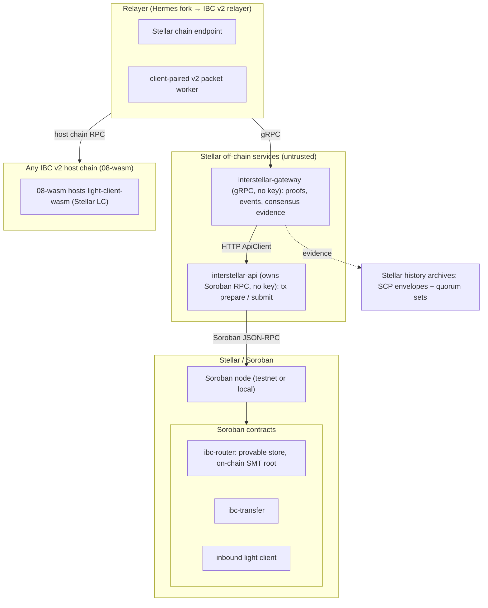
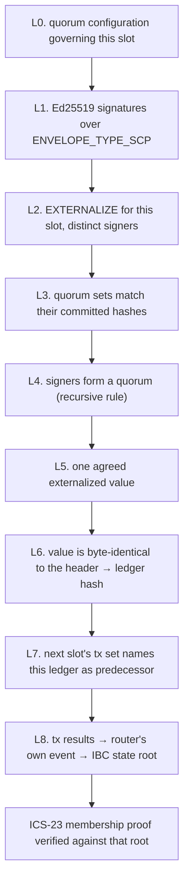
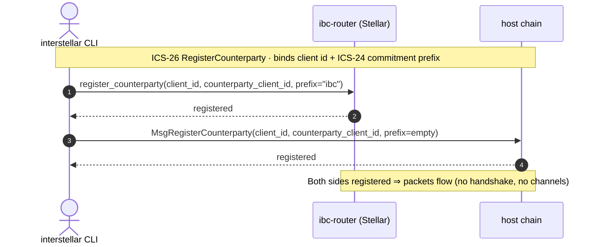
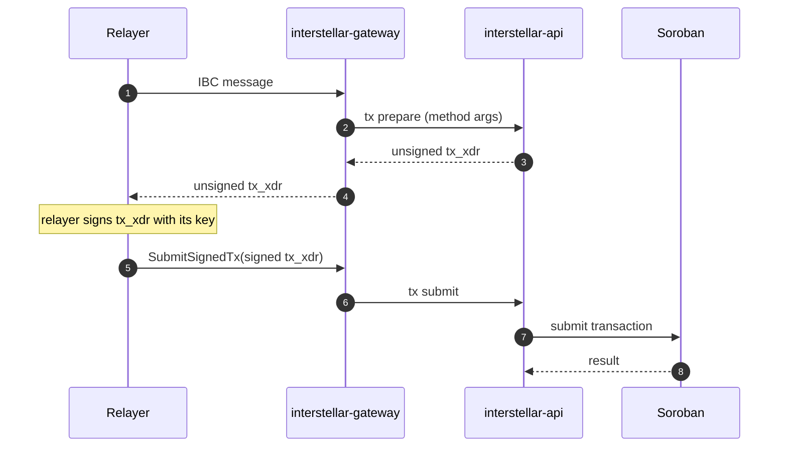
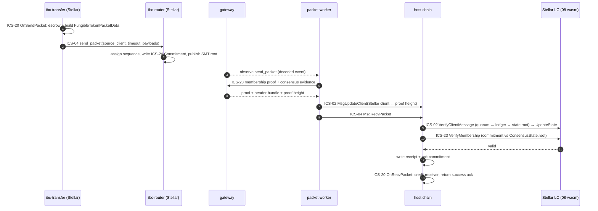
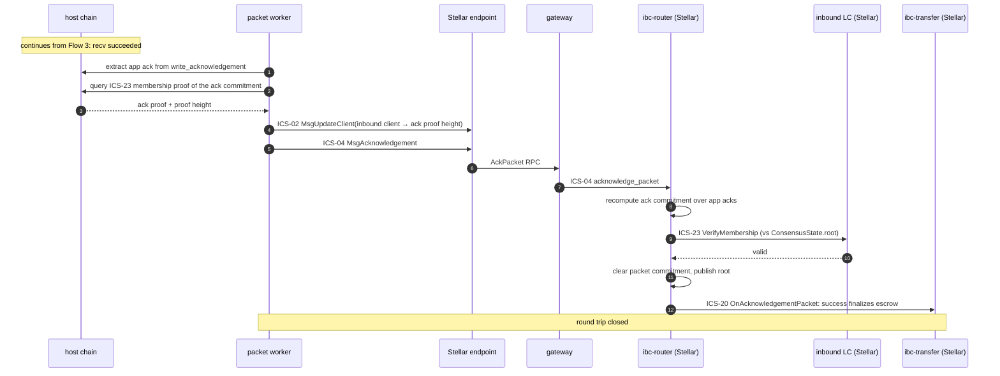
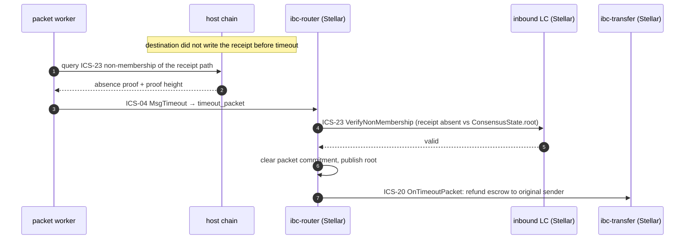

# Architecture
{: .no_toc }

How Interstellar is put together: the trust model, the components and their
responsibilities, the data flows that move a transfer across chains, and how it
all runs. Written for reviewers, integrators, and contributors.

{: .note }
> The implementation is currently in a private repository and will be
> open-sourced once it stabilizes. The component and type names below
> (`ibc-router`, `light-client-wasm`, …) describe that codebase.

## Contents
{: .no_toc .text-delta }

1. TOC
{:toc}

---

## 1. System overview

This is an implementation of the Interchain Standards for **Stellar** (Soroban
smart contracts, SCP consensus), so that Stellar can exchange IBC packets with
**any chain that hosts an IBC light client**, a network of 115+ chains today.
What travels between chains is a standard packet, a standard proof, and a client
artifact the host chain loads. Nothing in the design is specific to a particular
counterparty.

The defining property is that **no component holds bridge funds or attests to
events off-chain.** Verification happens inside on-chain light clients. The
relayer, gateway, and api are untrusted transport.

### Trust model

IBC is trust-minimized because packet authenticity is checked by an **on-chain
light client of the source chain, running inside the destination chain**:

- A packet sent on chain A is committed to A's provable state.
- The relayer carries the packet plus a Merkle proof to chain B.
- Chain B's light client of A verifies the proof against a header it has already
  accepted from A. If the proof is valid, the packet is genuine.

There is no validator committee, no multisig federation, no off-chain signer set
that can be compromised to forge a transfer. The security of a packet equals the
security of the two underlying chains, nothing weaker.

| Role | Holds funds? | Holds keys? | Trusted for correctness? |
|---|---|---|---|
| `ibc-router` + light clients (on-chain) | escrow only | — | **yes**, this is the verification root |
| `interstellar-api` | no | no | no, builds unsigned transactions and submits pre-signed ones |
| `interstellar-gateway` | no | no | no, it supplies evidence the client verifies, not assertions it accepts |
| relayer | no | yes (its own fee key) | no, a wrong/missing relay cannot forge a packet, only delay it |

A malicious relayer can censor or stall, but cannot mint, steal, or forge, the
on-chain light client rejects any packet without a valid proof. The gateway is
the component exposed to the relayer's network surface, and it deliberately
cannot move funds: it holds no signing key and has no chain connection of its
own.

### Provable state (IBC v2)

IBC v2 (Eureka) keeps only **three** provable paths (the packet lifecycle)
versus eight in v1. This is decisive on Stellar, where Soroban storage is
rent-priced per byte:

| Value | Path bytes |
|---|---|
| Packet Commitment | `{sourceClientId} \|\| 0x01 \|\| be64(sequence)` |
| Packet Receipt | `{destClientId} \|\| 0x02 \|\| be64(sequence)` |
| Acknowledgement Commitment | `{destClientId} \|\| 0x03 \|\| be64(sequence)` |

These live in a **deterministic fixed-depth-64 binary Sparse Merkle Tree (SMT)**,
a shape that is viable precisely because v2 dropped channels and handshakes. The
leaf, inner, and index rules are shared with other IBC implementations, so proofs
interoperate without a bespoke verifier per pair. The SMT root is the
`ConsensusState.root` that counterparty light clients verify against. Proofs are
serialized as ICS-23 `MerkleProof`s: membership proves a commitment exists (recv
/ ack); non-membership proves a receipt is absent (timeout).

**The root is maintained on-chain.** `ibc-router` recomputes the root on every
provable write, stores it, and publishes it as a contract event. A successful
transaction therefore *implies* a correctly derived root, there is no step where
an off-chain service asserts one. The router also exposes a call to republish the
current root without a state change, so a quiet link can still give the
counterparty a recent root to bind against.

Because client / connection / channel state is not provable in v2, the gateway's
client/consensus/next-sequence queries intentionally return `Unimplemented`.

Encoding details that had to match the reference implementation exactly: the
packet-commitment timeout is hashed **big-endian** (`sha256(be64(timeout))`); the
counterparty merkle prefix is **empty** on the host side and `ibc` on the Stellar
side; a membership proof embeds the **value hash**, so the light client compares
`proof_value == sha256(value)`; ICS-20 data is JSON `FungibleTokenPacketData`
with `version = "ics20-1"`, `encoding = "application/json"`.

### Multi-chain extensibility

The investment is **infrastructure, not a point bridge**. With *n* IBC chains,
custom bridges cost about n²/2 pairwise integrations; IBC costs *n* light clients
+ 1 shared protocol + 1 generalized relayer. The marginal cost of the next chain
is **one light client + one chain endpoint**.

The client is a portable artifact, not a deployment: `light-client-wasm` is a
wasm blob that any `08-wasm`-capable host loads without forking its binary, so
the same artifact that verifies Stellar for one host verifies it for every other.
Once two chains both speak IBC they talk directly, with no third chain in the
middle, which is what makes multi-hop and direct pairings on the roadmap possible
without new bridge code.

### Status by ICS standard

Progress is tracked against the Interchain Standards this stack implements, not
against ad-hoc implementation phases.

| ICS standard | Scope in this bridge | State |
|---|---|---|
| **ICS-26. Routing Module** | `ibc-router` dispatch and IBC v2 counterparty registration on both sides | done |
| **ICS-24. Host Requirements** | commitment / receipt / ack paths in the provable SMT store | done, byte-exact against the reference implementation |
| **ICS-02. Client Semantics** | the inbound light client on Stellar, and the Stellar light client hosted via `08-wasm` | both implemented on-chain |
| **ICS-23. Vector Commitments** | ICS-23 membership / non-membership `MerkleProof`s over the SMT | done |
| **ICS-04. Packet Semantics** | `send` / `recv` / `acknowledge` / `timeout` | done |
| **ICS-20. Fungible Token Transfer** | escrow → relay → credit, `FungibleTokenPacketData`, over the Stellar Asset Contract token interface | done |

IBC v2 (Eureka) has no connection or channel handshake, so the v1 ICS-03
(Connection) and the handshake half of ICS-04 (Channel) do not apply, packet
semantics survive in ICS-04, counterparty wiring moves to ICS-26.

{: .warning }
> **Implementation status.** Packet flows run end to end on a devnet. The Stellar
> consensus verification in § 4 is implemented on-chain and validated link by
> link against live mainnet data, including a negative suite showing each check
> fails closed. The off-chain services assemble the evidence bundle the client
> expects, and the relayer pins its trust root against a shipped constant rather
> than accepting one over the wire. Client-lifecycle hardening, the on-chain
> cost budget for verification, and a security review are still ahead.

---

## 2. Components

The system splits into four layers: the Stellar on-chain protocol, the Stellar
off-chain services, the relayer, and the counterparty-side light client plus
orchestration.

### a. Stellar on-chain layer

| Component | Responsibility |
|---|---|
| **`ibc-router`** | The IBC v2 core on Stellar. Registers client types and counterparties, dispatches `send` / `recv` / `ack` / `timeout`, and owns the provable commitment / receipt / ack store, including recomputing, storing, and publishing the SMT root on every provable write. |
| **`ibc-transfer`** | ICS-20 application. Escrows on send, credits on receive, refunds on timeout or failed ack, and settles on a successful ack. Encodes and decodes `FungibleTokenPacketData`. Value moves over the **Stellar Asset Contract (SAC)** token interface, so native XLM and issued assets are escrowed by their canonical SAC address; an inbound denom is minted as a voucher token deployed deterministically from that denom. |
| **inbound light client** | Verifies counterparty headers and membership proofs on Stellar. Development-only variants (`mock`, `attestation`) exist for testing and are excluded from real deployments. |
| **shared core library** | Underneath the contracts and services: the fixed-depth-64 SMT, the ICS-23 proof serializer, the IBC commitment paths, the client/consensus types and reverse codecs, ledger close-meta replay, the Soroban RPC client, and the HTTP `ApiClient`. |

### b. Stellar off-chain services

| Component | Responsibility |
|---|---|
| **`interstellar-gateway`** | The gRPC service the relayer talks to. Holds **no** Soroban connection and **no** key, every call is fulfilled through `ApiClient` against `interstellar-api`. Serves proofs, decodes router events into IBC-shaped attributes, and supplies the consensus evidence the counterparty light client verifies. |
| **`interstellar-api`** | The standalone HTTP service that owns the only Soroban RPC connection in the system, and holds no signing key. Builds unsigned transactions, submits transactions signed by their originator, and exposes ledger / account / event / archive reads. |

### c. Relayer: Hermes today, the IBC v2 relayer next

The link runs today on a fork of **Hermes** carrying Stellar support: a Stellar
chain endpoint that polls the gateway for events, builds IBC v2 messages, signs
with the relayer key and submits them; Stellar client/consensus types that unwrap
the `08-wasm` envelope so the relayer tracks the Stellar client like a native
one; and a v2 packet worker that is **client-paired rather than channel-paired**
(IBC v2 has no channels), carrying a proof source, client updater, and submitter
for **each** direction.

#### Migrating to the IBC v2 relayer

The relayer is being migrated to the **IBC v2 relayer**, for one architectural
reason above all: **it does not embed chain-specific proof logic.** It obtains
proofs from a separate **proof API** over gRPC, and is request-driven,
Postgres-backed, batches recv / ack / timeout independently, retries failed
submissions, tracks transaction costs, and supports remote signing.

The fit is good because the proof service already exists: `interstellar-gateway`
already exposes that proof API alongside its own services, on the same gRPC port,
so **the proof half of the integration needs no fork**. The relayer is wired up
alongside Postgres with both chains configured and routing authored.

What the migration adds is a Stellar chain type: transaction construction and
submission as Soroban `InvokeHostFunction` calls, signing (either via the
relayer's remote-signer interface backed by `interstellar-api`, or a local key),
and a finality rule, a ledger is final once SCP externalizes its value, with no
additional confirmations. One standing constraint: Soroban allows one
`InvokeHostFunction` per transaction and `ibc-router.recv_packet` takes a single
packet, so every Stellar-bound batch stays at one packet until the router grows a
batch entrypoint. Batching applies normally in the other direction.

Completing this retires the fork and the work of tracking it against upstream.

### d. Counterparty light client & orchestration

| Component | Responsibility |
|---|---|
| **`light-client-wasm`** | The **Stellar** light client, compiled to wasm and deployed on the host chain via `08-wasm`. Verifies signed SCP `EXTERNALIZE` statements, evaluates the quorum, binds the agreed value to a Stellar ledger, binds that ledger to the IBC state root, and checks ICS-23 proofs against it. `08-wasm` lets any IBC v2 host chain run it without forking its binary. |
| **`interstellar` CLI** | The orchestrator: deploys contracts, uploads the wasm light client, creates clients, registers counterparties, runs the services, originates transfers, and ships the consensus verifier described in § 4. |

#### Light clients verify in both directions

A link needs each chain to verify the other, so there are two light clients:

- **Into Stellar**, the inbound client on Soroban accepts the counterparty's
  client/consensus state, verifies header updates against its validator set and
  voting power, and checks ICS-23 membership proofs against the stored consensus
  root.
- **Out of Stellar**, `light-client-wasm` via `08-wasm`. Its model is
  deliberately **not** validator-set-with-voting-power. Stellar does not use a
  single globally configured validator set or stake-weighted voting, so there is
  no ">2/3 of the validators" to count. The client verifies signed SCP
  `EXTERNALIZE` statements for the slot, Ed25519 over
  `networkID ‖ xdr(ENVELOPE_TYPE_SCP) ‖ xdr(SCPStatement)`, then evaluates
  whether the signers form a **quorum** under the configuration it trusts for
  that ledger, using Stellar's own recursive rule rather than a threshold count.
  Section 4 walks through the full chain.

---

## 3. Data flows

Each flow is named with the Interchain Standards it exercises. The ICS operation
names are used directly: `send` / `recv` / `acknowledge` / `timeout` are ICS-04
(packet semantics); `OnSendPacket` / `OnRecvPacket` / `OnAcknowledgementPacket` /
`OnTimeoutPacket` are the ICS-26 routing callbacks into the ICS-20 application;
`VerifyClientMessage` / `UpdateState` are ICS-02 (client); `VerifyMembership` /
`VerifyNonMembership` are ICS-23 (commitments) over the ICS-24 host paths.

### Flow 1: Counterparty registration · ICS-26 + ICS-24

IBC v2 replaces the v1 connection + channel handshake (8 messages) with a single
`RegisterCounterparty` per side, binding a local client to its counterparty
client id and **commitment (merkle) prefix**, the ICS-24 prefix under which that
counterparty stores its provable paths. On Stellar this is an `ibc-router` call;
on the host chain it is the equivalent `MsgRegisterCounterparty`. The prefix is
`ibc` on the Stellar side and **empty** on the host side (Stellar SMT keys are
unprefixed). After both sides register, packets flow immediately, with no version
negotiation, no port binding, and no handshake.

### Flow 2: Transaction model (prepare → sign → submit)

The transport mechanism beneath every ICS-26 message dispatch on the Stellar
side. Transactions are built where the chain connection lives
(`interstellar-api`) and signed where the key lives (the relayer), but **driven**
by the relayer, so the gateway never holds a key. The relayer sends an IBC
message to the gateway; the gateway asks the api to prepare an unsigned `tx_xdr`;
the relayer signs it and hands it back; the gateway submits it through the api to
Soroban. Preparation is method-agnostic, so every ICS message (`create_client`
and `update_client` (ICS-02), `register_counterparty` (ICS-26), `recv_packet` /
`acknowledge_packet` / `timeout_packet` (ICS-04)) flows through one path.

### Flow 3: Outbound transfer · ICS-20 send + ICS-04 recv

1. **ICS-20 send.** `ibc-transfer.initiate_transfer(...)` runs `OnSendPacket`:
   escrows the asset and builds the `FungibleTokenPacketData`
   (`version = "ics20-1"`, `encoding = "application/json"`).
2. **ICS-04 send.** `ibc-router.send_packet(source_client, timeout, payloads[])`
   assigns the sequence, writes the **Packet Commitment** to the ICS-24
   commitment path in the SMT (`sha256` over the canonical packet fields, with
   the timeout hashed **big-endian**), and recomputes and publishes the SMT root.
3. The relayer observes the `send_packet` event and requests the **ICS-23
   membership proof** of the commitment, together with the consensus evidence for
   the ledger, from the gateway.
4. **ICS-02 client update.** A proof newer than the client is rejected, so the
   worker first builds `MsgUpdateClient` advancing the destination Stellar client
   to the proof height, then `MsgRecvPacket`, and submits them together.
5. **On-chain verification.** The host chain runs the Stellar light client:
   `VerifyClientMessage` walks the whole chain in § 4 → `UpdateState` stores the
   authenticated root, then `VerifyMembership` checks the commitment proof
   against it. On success, ICS-04 writes the **receipt** + **acknowledgement
   commitment**, and the ICS-26 router invokes ICS-20 `OnRecvPacket`, which
   **credits the receiver** and returns the success acknowledgement.

### Flow 4: Ack-back leg · ICS-04 acknowledge + ICS-20 settle

The same worker chains straight into the acknowledgement direction so the source
commitment is cleared and the ICS-20 application settles:

1. **Extract the ack.** Read the application acknowledgement from the host
   chain's recv-tx `write_acknowledgement` event.
2. Query the **ICS-23 membership proof** of the acknowledgement commitment from
   the host chain, against its consensus root.
3. **ICS-02 client update.** Build `MsgUpdateClient` advancing the inbound client
   on Stellar to the ack proof height.
4. **ICS-04 acknowledge.** Build `MsgAcknowledgement`, routed through the Stellar
   endpoint → gateway `AckPacket` RPC → `ibc-router.acknowledge_packet`. The
   router recomputes the acknowledgement commitment over the app acks, runs
   `VerifyMembership` via the inbound light client, and **clears the packet
   commitment**.
5. **ICS-20 settle.** The ICS-26 router invokes ICS-20 `OnAcknowledgementPacket`:
   a success ack finalizes the escrow; a failure ack refunds it.

### Flow 5: Timeout / refund · ICS-04 timeout + ICS-23 non-membership

If the destination never writes the receipt before the timeout, the relayer
proves **ICS-23 non-membership** of the receipt path (an absence proof against
the counterparty root) and submits `timeout_packet` to the source `ibc-router`.
The router verifies the absence proof, clears the commitment, and the ICS-26
router invokes ICS-20 `OnTimeoutPacket`, refunding the escrow to the original
sender.

{: .note }
> The inbound direction is symmetric: an ICS-20 transfer on the host chain,
> ICS-04 `recv_packet` on the Stellar router (ICS-23 proof verified by the
> inbound light client), ICS-20 credit on Stellar, and the acknowledgement
> relayed back.

---

## 4. How Stellar consensus is verified

This is the part with no established reference implementation to follow, so it is
worth setting out in full.

### Why Stellar is the harder direction

A chain with one globally agreed validator set and voting power makes
*"validators holding more than two-thirds of the power signed this block"* a
well-defined statement, and its header commits to the application state root
directly. The Soroban client checks exactly that for the inbound direction.

Stellar has no equivalent on either count. It uses **Federated Byzantine
Agreement**: there is no single configured validator set and no stake weighting.
Each node chooses which sets of peers it will listen to, and agreement is defined
relative to those choices. Four terms carry most of the weight:

| Term | Meaning |
|---|---|
| **slot** | one consensus instance, on Stellar, the slot number is the ledger sequence number |
| **quorum slice** | a set of nodes that is enough to convince *one particular node* of something |
| **quorum** | a set of nodes containing a slice for **every one of its own members** |
| **externalize** | the moment a node commits to a value for a slot, irreversibly, the event a light client must prove happened |

Two consequences shape the design. First, **there is no threshold to count to**:
the client has to evaluate whether a specific set of signers forms a quorum,
using the recursive structure Stellar validators publish. Observed on mainnet in
August 2026, that structure was *5 of 7 organizations, each 2 of 3 validators*,
21 signatures for a single ledger. Second, **the configuration is not carried in
the protocol**: a validator-set-based client learns the next set from the chain
itself, and SCP offers nothing equivalent. The trusted configuration therefore
comes from outside, is governed deliberately, and, because it changes over time,
is stored with the range of ledgers each version applies to.

### Two claims, kept apart

```
SCP safety      → a quorum externalized value x for slot N   (what the protocol guarantees)
Ledger binding  → x is exactly the ledger header's own value (how stellar-core builds a ledger)
State binding   → that ledger commits to the IBC state root  (this project's construction)
```

Only the first is a property of SCP. A chain whose verified header carries the
state root directly gets the second and third almost free. On Stellar they have
to be built, and a quorum of valid signatures says nothing on its own about which
ledger or which state root travelled alongside it. Conflating the two is the
easiest way to end up with a client that performs real cryptography and still
proves nothing about the ledger.

### The checks, in order

| # | Check | In plain terms |
|---|---|---|
| L0 | Configuration applies | pick the trusted quorum configuration that governs this ledger; refuse if none does |
| L1 | Signatures | every message really was signed by the validator it names |
| L2 | Right kind of message | each is an `EXTERNALIZE` statement, for the slot being claimed, from a distinct signer |
| L3 | Quorum sets are genuine | each signer's published configuration matches the hash it committed to |
| L4 | The signers form a quorum | evaluated with Stellar's own recursive rule, not a count |
| L5 | They agree | all signers externalized the same value; ballot counters are ignored |
| L6 | The value is this ledger | the agreed value is byte-identical to the header's own field, so the header, and its hash, is authenticated |
| L7 | The rest of the header is authentic | the next slot's transaction set names this ledger's hash as its predecessor, which is what covers the header fields SCP does not sign |
| L8 | The ledger commits to the root | follow the header's commitment to transaction results down to the router's own contract event carrying the state root |

L0–L5 establish *that consensus happened*. L6–L8 establish *which ledger, and
which root*. Both are needed; neither implies the other.

Three of these deserve expanding, because each closes a trap that is cheap to
fall into:

**Why a recursive rule, not a threshold (L4).** Quorum configurations nest, and
the real network uses the nesting. A flat *m*-of-*n* check errs in both
directions: it can pass a signer set that is not a quorum, and fail one that is.

**Why the next slot is involved (L7).** SCP externalizes a value of
`(txSetHash, closeTime, upgrades)` and nothing else. It does not sign the
header's state-related fields. The following slot's transaction set carries the
previous ledger's hash, so externalizing slot N+1 is what authenticates the rest
of ledger N. Stated plainly: this leans on a `stellar-core` rule that validators
check that field before voting, not on a whitepaper guarantee.

**Why the root comes from an event (L8).** The invocation success record does not
say which contract was invoked, so taking the root from a return value would
accept a root from *any* contract. A contract event carries an emitter id set by
the host that no contract can forge, so the client is configured with the
router's id and reads the root only from the router's own event.

### What this was checked against

The rules come from the SCP whitepaper (Mazières, *The Stellar Consensus
Protocol*, 2016). Wire-level details (the exact signing preimage, enum values,
structure layouts, and how a ledger header is built from an externalized value)
come from the `stellar-core` source and `stellar-xdr`, pinned to versions; those
are implementation facts, not protocol facts.

Neither was taken on trust. A reference checker, shipped in the CLI as
`interstellar verify --ledger <n>`, fetches the archived SCP messages, quorum
sets and ledger header for a given ledger from Stellar's public history archives
and runs every check the contract must run, using the contract's own primitives:

- **L1–L7** were confirmed on live data from both networks, 21 signers under the
  nested mainnet configuration, 3 under a flat testnet one.
- **L8** was checked in two halves: the transaction-result hash matched the
  ledger header for **64 of 64** mainnet ledgers in a checkpoint, and the
  contract-return commitment matched the recorded hash for **40 of 40** Soroban
  invocations across eight consecutive testnet ledgers.
- A **negative suite** applies one mutation per case and confirms each check
  fails closed rather than silently passing.

Archive data is self-authenticating: every envelope carries a signature the
client verifies itself, so the archive is a file server rather than a trusted
party. Its 64-ledger checkpoint cadence puts a floor of roughly five and a half
minutes on outbound proof latency, which the relayer accounts for when choosing
packet timeouts; a non-validating watcher node supplies the same data in real
time for deployments that need it.

### What safety rests on

One assumption cannot be discharged on-chain: that the configured quorum
configuration is sufficiently related to the real Stellar network **for the
ledger in question**. Misconfiguration is not degraded security, it means
silently following a different view of the network with every signature valid.
That is checked off-chain with SDF's quorum-analysis tooling before a client is
created and at every configuration change, then monitored for drift afterwards,
and it needs a named owner. Everything else (signatures, quorum evaluation,
parsing, and the bindings) is implementation correctness, addressed by the checks
above and by testing against real ledgers.

A note on finality: a Stellar ledger is final once SCP externalizes the
corresponding value. The link requires no additional confirmations.

---

## 5. Deployment and infrastructure

Everything is driven by the `interstellar` CLI. A full local bring-up:

```sh
interstellar start                    # deploy contracts, upload the wasm LC, import relayer keys
interstellar tx clients counterparty  # create both clients and register counterparties
interstellar tx transfer              # originate an ICS-20 transfer
interstellar verify --ledger <n>      # verify Stellar consensus for one ledger, layer by layer
```

The moving parts run as containers (the counterparty chain, the gateway, the api,
and the relayer) composed with healthchecks and dependency ordering so each
service waits for its dependencies to be ready.

Because the whole stack is Rust (contracts, core, gateway, api, wasm light
client, and the relayer fork), the integration is debuggable end-to-end in one
toolchain. The relayer inherits Hermes's event loop, transaction queueing, client
refresh, fee estimation, key management, and configuration unchanged; only the
chain-specific endpoint and the v2 packet worker are added.

---

## 6. Architecture diagrams

### Component topology



### The chain of custody, out of Stellar



### Flow 1: Counterparty registration · ICS-26 + ICS-24



### Flow 2: Transaction model (prepare → sign → submit)



### Flow 3: Outbound transfer · ICS-20 send + ICS-04 recv



### Flow 4: Ack-back leg · ICS-04 acknowledge + ICS-20 settle



### Flow 5: Timeout / refund · ICS-04 timeout + ICS-23 non-membership


