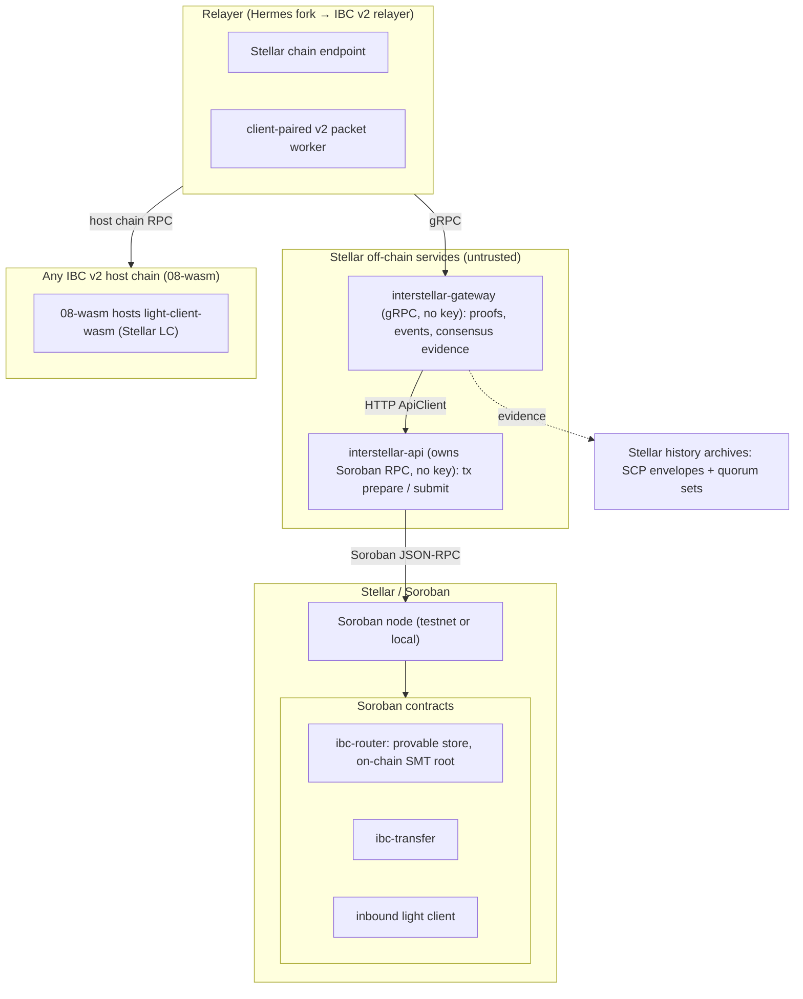
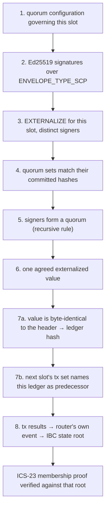
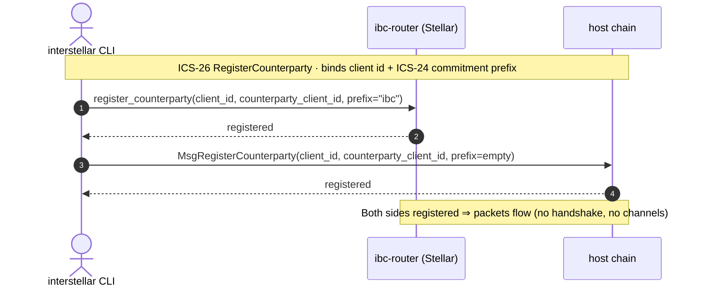
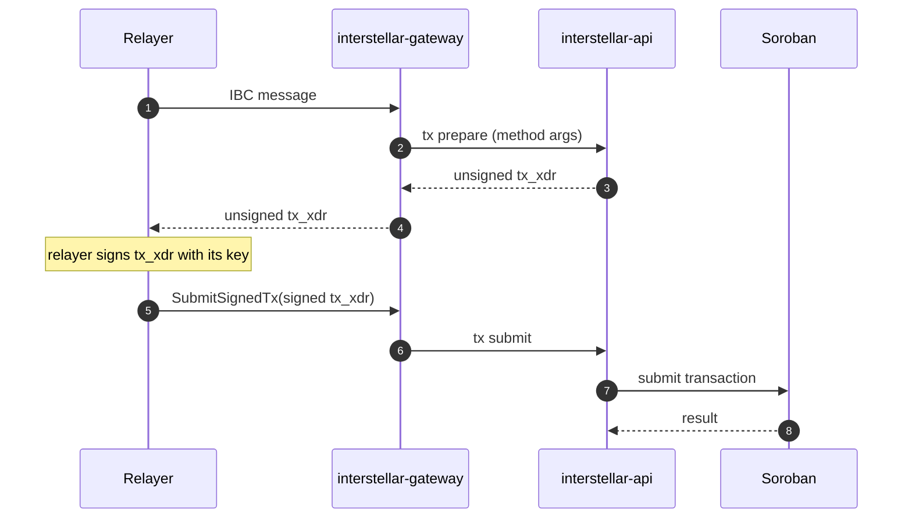
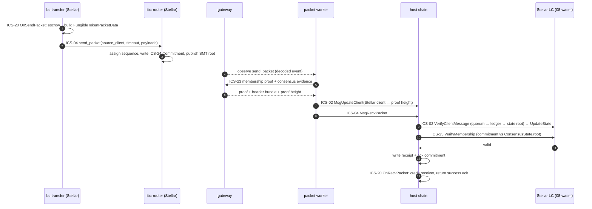
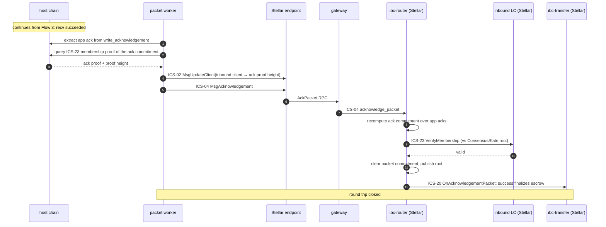
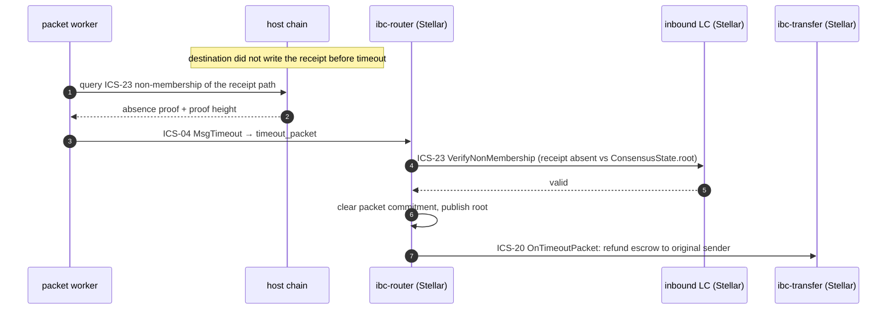

# Architecture
{: .no_toc }

How Interstellar is put together: the trust model, the components and their
responsibilities, the data flows that move a transfer across chains, and how it
all runs. Written for reviewers, integrators, and contributors.

{: .note }
> The implementation is currently in a private repository and will be
> open-sourced once it stabilizes. The component and type names below
> (`ibc-router`, `light-client-wasm`, …) describe that codebase.

## Contents
{: .no_toc .text-delta }

1. TOC
{:toc}

---

## 1. System overview

This is an implementation of the Interchain Standards for **Stellar** (Soroban
smart contracts, SCP consensus), so that Stellar can exchange IBC packets with
**any chain that hosts an IBC light client**, a network of 115+ chains today.
What travels between chains is a standard packet, a standard proof, and a client
artifact the host chain loads. Nothing in the design is specific to a particular
counterparty.

The defining property is that **no component holds bridge funds or attests to
events off-chain.** Verification happens inside on-chain light clients. The
relayer, gateway, and api are untrusted transport.

### Design goals

Five rules that decide every trade-off below:

1. **Nothing off-chain is ever believed.** Every cross-chain claim is checked by
   on-chain code against evidence that proves its own authenticity.
2. **Fail closed.** Missing or malformed evidence rejects the header. The system
   never falls back to trusting whoever delivered it.
3. **Evidence, not assertion.** Off-chain components hand over bytes that carry
   their own signatures.
4. **Stay standard.** Deviate from IBC only where Stellar's consensus or
   execution model forces it, and write down each deviation.
5. **Stay portable.** The Stellar light client is one wasm artifact that any
   `08-wasm` host can load.

### Trust model

IBC is trust-minimized because packet authenticity is checked by an **on-chain
light client of the source chain, running inside the destination chain**:

- A packet sent on chain A is committed to A's provable state.
- The relayer carries the packet plus a Merkle proof to chain B.
- Chain B's light client of A verifies the proof against a header it has already
  accepted from A. If the proof is valid, the packet is genuine.

There is no validator committee, no multisig federation, no off-chain signer set
that can be compromised to forge a transfer. The security of a packet equals the
security of the two underlying chains, nothing weaker.

| Role | Holds funds? | Holds keys? | Trusted for correctness? |
|---|---|---|---|
| `ibc-router` + light clients (on-chain) | escrow only | — | **yes**, this is the verification root |
| `interstellar-api` | no | no | no, builds unsigned transactions and submits pre-signed ones |
| `interstellar-gateway` | no | no | no, it supplies evidence the client verifies, not assertions it accepts |
| relayer | no | yes (its own fee key) | no, a wrong/missing relay cannot forge a packet, only delay it |

A malicious relayer can censor or stall, but cannot mint, steal, or forge, the
on-chain light client rejects any packet without a valid proof. The gateway is
the component exposed to the relayer's network surface, and it deliberately
cannot move funds: it holds no signing key and has no chain connection of its
own. Transactions follow **prepare → sign → submit**, and whoever originates a
transaction is the one who signs it.

The history archives sit in the same untrusted row: they hold no funds, no keys,
and are trusted for nothing, because every envelope they serve carries its own
signature.

There is exactly **one boundary in the system that is not cryptographic**, and
that is the quorum configuration the client trusts. No contract can check it from
the inside. It is treated as the safety-critical setting it is in
[§ 7](#7-failure-recovery-and-security-analysis).

### Evidence model

Everything the light client consumes proves its own authenticity. SCP envelopes
carry Ed25519 signatures made by named validators over exact statement bytes.
Quorum sets are checked against the hashes the statements committed to. Ledger
headers are checked by rehashing them.

That property is what makes the archive **a file server rather than a trusted
party**. Any host serving the same bytes is equivalent, and a host serving
different bytes gets caught by the first check.

An RPC response is a different kind of thing. It is an *assertion* by whoever
answered the call, with no signature behind it. This design never treats one as
evidence.

### Provable state (IBC v2)

IBC v2 (Eureka) keeps only **three** provable paths (the packet lifecycle)
versus eight in v1. This is decisive on Stellar, where Soroban storage is
rent-priced per byte:

| Value | Path bytes |
|---|---|
| Packet Commitment | `{sourceClientId} \|\| 0x01 \|\| be64(sequence)` |
| Packet Receipt | `{destClientId} \|\| 0x02 \|\| be64(sequence)` |
| Acknowledgement Commitment | `{destClientId} \|\| 0x03 \|\| be64(sequence)` |

These live in a **deterministic fixed-depth-64 binary Sparse Merkle Tree (SMT)**,
a shape that is viable precisely because v2 dropped channels and handshakes. The
leaf, inner, and index rules are shared with other IBC implementations, so proofs
interoperate without a bespoke verifier per pair. The SMT root is the
`ConsensusState.root` that counterparty light clients verify against. Proofs are
serialized as ICS-23 `MerkleProof`s: membership proves a commitment exists (recv
/ ack); non-membership proves a receipt is absent (timeout).

**The root is maintained on-chain.** `ibc-router` recomputes the root on every
provable write, stores it, and publishes it as a contract event. A successful
transaction therefore *implies* a correctly derived root, there is no step where
an off-chain service asserts one. The router also exposes a call to republish the
current root without a state change, so a quiet link can still give the
counterparty a recent root to bind against.

Because client / connection / channel state is not provable in v2, the gateway's
client/consensus/next-sequence queries intentionally return `Unimplemented`.

Encoding details that had to match the reference implementation exactly: the
packet-commitment timeout is hashed **big-endian** (`sha256(be64(timeout))`); the
counterparty merkle prefix is **empty** on the host side and `ibc` on the Stellar
side; a membership proof embeds the **value hash**, so the light client compares
`proof_value == sha256(value)`; ICS-20 data is JSON `FungibleTokenPacketData`
with `version = "ics20-1"`, `encoding = "application/json"`.

### Multi-chain extensibility

The investment is **infrastructure, not a point bridge**. With *n* IBC chains,
custom bridges cost about n²/2 pairwise integrations; IBC costs *n* light clients
+ 1 shared protocol + 1 generalized relayer. The marginal cost of the next chain
is **one light client + one chain endpoint**.

The client is a portable artifact, not a deployment: `light-client-wasm` is a
wasm blob that any `08-wasm`-capable host loads without forking its binary, so
the same artifact that verifies Stellar for one host verifies it for every other.
Once two chains both speak IBC they talk directly, with no third chain in the
middle, which is what makes multi-hop and direct pairings on the roadmap possible
without new bridge code.

### Status by ICS standard

Progress is tracked against the Interchain Standards this stack implements, not
against ad-hoc implementation phases.

| ICS standard | Scope in this bridge | State |
|---|---|---|
| **ICS-26. Routing Module** | `ibc-router` dispatch and IBC v2 counterparty registration on both sides | done |
| **ICS-24. Host Requirements** | commitment / receipt / ack paths in the provable SMT store | done, byte-exact against the reference implementation |
| **ICS-02. Client Semantics** | the inbound light client on Stellar, and the Stellar light client hosted via `08-wasm` | both implemented on-chain; lifecycle hardening in progress on the inbound client ([§ 6](#hardening-still-in-progress)) |
| **ICS-23. Vector Commitments** | ICS-23 membership / non-membership `MerkleProof`s over the SMT | done |
| **ICS-04. Packet Semantics** | `send` / `recv` / `acknowledge` / `timeout` | done |
| **ICS-20. Fungible Token Transfer** | escrow → relay → credit, `FungibleTokenPacketData`, over the Stellar Asset Contract token interface | done; denom-trace path prefixing not implemented |

IBC v2 (Eureka) has no connection or channel handshake, so the v1 ICS-03
(Connection) and the handshake half of ICS-04 (Channel) do not apply, packet
semantics survive in ICS-04, counterparty wiring moves to ICS-26.

{: .warning }
> **Implementation status.** Packet flows run end to end on a devnet. The Stellar
> consensus verification in § 4 is implemented on-chain and validated link by
> link against live mainnet data, including an 18-case negative suite showing
> each check fails closed. The off-chain services assemble the evidence bundle
> the client expects, and the relayer pins its trust root against a shipped
> constant rather than accepting one over the wire. Client-lifecycle hardening
> ([§ 6](#hardening-still-in-progress)), the on-chain cost budget for
> verification ([§ 8](#8-performance)), and a third-party security review are
> still ahead. Measured results are on
> [Implementation & Evidence](implementation.html).

---

## 2. Components

The system splits into four layers: the Stellar on-chain protocol, the Stellar
off-chain services, the relayer, and the counterparty-side light client plus
orchestration.

### a. Stellar on-chain layer

| Component | Responsibility |
|---|---|
| **`ibc-router`** | The IBC v2 core on Stellar. Registers client types and counterparties, dispatches `send` / `recv` / `ack` / `timeout`, and owns the provable commitment / receipt / ack store, including recomputing, storing, and publishing the SMT root on every provable write. |
| **`ibc-transfer`** | ICS-20 application. Escrows on send, credits on receive, refunds on timeout or failed ack, and settles on a successful ack. Encodes and decodes `FungibleTokenPacketData`. Value moves over the **Stellar Asset Contract (SAC)** token interface, so native XLM and issued assets are escrowed by their canonical SAC address; an inbound denom is minted as a voucher token deployed deterministically from that denom. |
| **inbound light client** | Verifies counterparty headers and membership proofs on Stellar. Development-only variants (`mock`, `attestation`) exist for testing and are excluded from real deployments. |
| **shared core library** | Underneath the contracts and services: the fixed-depth-64 SMT, the ICS-23 proof serializer, the IBC commitment paths, the client/consensus types and reverse codecs, ledger close-meta replay, the Soroban RPC client, and the HTTP `ApiClient`. |

### b. Stellar off-chain services

| Component | Responsibility |
|---|---|
| **`interstellar-gateway`** | The gRPC service the relayer talks to, twenty methods across a query service and a message service plus four on the proof API. Holds **no** Soroban connection and **no** key, every call is fulfilled through `ApiClient` against `interstellar-api`. Serves proofs, decodes router events into IBC-shaped attributes, and assembles the consensus evidence bundle the counterparty light client verifies. |
| **`interstellar-api`** | The standalone HTTP service that owns the only Soroban RPC connection in the system, and holds no signing key. Fourteen routes in three groups: chain reads, archive reads (the SCP messages, ledger header and transaction set that constitute the consensus evidence), and transaction prepare/submit. An OpenAPI document is generated from the handlers and a test asserts every routed endpoint appears in it. |

### c. Relayer: Hermes today, the IBC v2 relayer next

The link runs today on a fork of **Hermes** carrying Stellar support: a Stellar
chain endpoint that polls the gateway for events, builds IBC v2 messages, signs
with the relayer key and submits them; Stellar client/consensus types that unwrap
the `08-wasm` envelope so the relayer tracks the Stellar client like a native
one; and a v2 packet worker that is **client-paired rather than channel-paired**
(IBC v2 has no channels), carrying a proof source, client updater, and submitter
for **each** direction.

#### Migrating to the IBC v2 relayer

The relayer is being migrated to the **IBC v2 relayer**, for one architectural
reason above all: **it does not embed chain-specific proof logic.** It obtains
proofs from a separate **proof API** over gRPC, and is request-driven,
Postgres-backed, batches recv / ack / timeout independently, retries failed
submissions, tracks transaction costs, and supports remote signing.

The fit is good because the proof service already exists: `interstellar-gateway`
already exposes that proof API alongside its own services, on the same gRPC port,
so **the proof half of the integration needs no fork**. The relayer runs
alongside Postgres under its own compose profile, with both chains configured and
the routing authored: client identifiers per direction, per-direction batch
sizes, and an acknowledgement policy that relays success acknowledgements rather
than dropping them, because ICS-20 escrow only settles once the success
acknowledgement gets home.

What the migration adds is a Stellar chain type: transaction construction and
submission as Soroban `InvokeHostFunction` calls, signing (either via the
relayer's remote-signer interface backed by `interstellar-api`, or a local key),
and a finality rule, a ledger is final once SCP externalizes its value, with no
additional confirmations. One standing constraint: Soroban allows one
`InvokeHostFunction` per transaction and `ibc-router.recv_packet` takes a single
packet, so every Stellar-bound batch stays at one packet until the router grows a
batch entrypoint. Batching applies normally in the other direction.

{: .note }
> **Current state of the migration.** The relayer's chain-type abstraction covers
> Cosmos, EVM and SVM today, and a configuration entry of any other type is
> skipped when the bridge clients are built. The Stellar routing is therefore
> **authored and correct, but inert** until the Stellar chain type lands. Until
> then the Hermes fork carries the live link.

Completing this retires the fork and the work of tracking it against upstream.

### d. Counterparty light client & orchestration

| Component | Responsibility |
|---|---|
| **`light-client-wasm`** | The **Stellar** light client, compiled to wasm and deployed on the host chain via `08-wasm`. Verifies signed SCP `EXTERNALIZE` statements, evaluates the quorum, binds the agreed value to a Stellar ledger, binds that ledger to the IBC state root, and checks ICS-23 proofs against it. `08-wasm` lets any IBC v2 host chain run it without forking its binary. |
| **`interstellar` CLI** | The orchestrator: deploys contracts, uploads the wasm light client, creates clients, registers counterparties, runs the services, originates transfers, and ships the consensus verifier described in § 4. |

#### Light clients verify in both directions

A link needs each chain to verify the other, so there are two light clients:

- **Into Stellar**, the inbound client on Soroban accepts the counterparty's
  client/consensus state, verifies header updates against its validator set and
  voting power, and checks ICS-23 membership proofs against the stored consensus
  root. [Section 6](#6-verifying-the-counterparty-on-stellar) sets out its six
  checks and the controls around them.
- **Out of Stellar**, `light-client-wasm` via `08-wasm`. Its model is
  deliberately **not** validator-set-with-voting-power. Stellar does not use a
  single globally configured validator set or stake-weighted voting, so there is
  no ">2/3 of the validators" to count. The client verifies signed SCP
  `EXTERNALIZE` statements for the slot, Ed25519 over
  `networkID ‖ ENVELOPE_TYPE_SCP ‖ xdr(SCPStatement)`, then evaluates whether the
  signers form a **quorum** under the configuration it trusts for that ledger,
  using Stellar's own recursive rule rather than a threshold count.
  [Section 4](#4-how-stellar-consensus-is-verified) walks through the full chain
  and [section 5](#5-the-stellar-light-client-lifecycle) through its lifecycle.

---

## 3. Data flows

Each flow is named with the Interchain Standards it exercises. The ICS operation
names are used directly: `send` / `recv` / `acknowledge` / `timeout` are ICS-04
(packet semantics); `OnSendPacket` / `OnRecvPacket` / `OnAcknowledgementPacket` /
`OnTimeoutPacket` are the ICS-26 routing callbacks into the ICS-20 application;
`VerifyClientMessage` / `UpdateState` are ICS-02 (client); `VerifyMembership` /
`VerifyNonMembership` are ICS-23 (commitments) over the ICS-24 host paths.

### Flow 1: Counterparty registration · ICS-26 + ICS-24

IBC v2 replaces the v1 connection + channel handshake (8 messages) with a single
`RegisterCounterparty` per side, binding a local client to its counterparty
client id and **commitment (merkle) prefix**, the ICS-24 prefix under which that
counterparty stores its provable paths. On Stellar this is an `ibc-router` call;
on the host chain it is the equivalent `MsgRegisterCounterparty`. The prefix is
`ibc` on the Stellar side and **empty** on the host side (Stellar SMT keys are
unprefixed). After both sides register, packets flow immediately, with no version
negotiation, no port binding, and no handshake.

### Flow 2: Transaction model (prepare → sign → submit)

The transport mechanism beneath every ICS-26 message dispatch on the Stellar
side. Transactions are built where the chain connection lives
(`interstellar-api`) and signed where the key lives (the relayer), but **driven**
by the relayer, so the gateway never holds a key. The relayer sends an IBC
message to the gateway; the gateway asks the api to prepare an unsigned `tx_xdr`;
the relayer signs it and hands it back; the gateway submits it through the api to
Soroban. Preparation is method-agnostic, so every ICS message (`create_client`
and `update_client` (ICS-02), `register_counterparty` (ICS-26), `recv_packet` /
`acknowledge_packet` / `timeout_packet` (ICS-04)) flows through one path.

### Flow 3: Outbound transfer · ICS-20 send + ICS-04 recv

1. **ICS-20 send.** `ibc-transfer.initiate_transfer(...)` runs `OnSendPacket`:
   escrows the asset and builds the `FungibleTokenPacketData`
   (`version = "ics20-1"`, `encoding = "application/json"`).
2. **ICS-04 send.** `ibc-router.send_packet(source_client, timeout, payloads[])`
   assigns the sequence, writes the **Packet Commitment** to the ICS-24
   commitment path in the SMT (`sha256` over the canonical packet fields, with
   the timeout hashed **big-endian**), and recomputes and publishes the SMT root.
3. The relayer observes the `send_packet` event and requests the **ICS-23
   membership proof** of the commitment, together with the consensus evidence for
   the ledger, from the gateway.
4. **ICS-02 client update.** A proof newer than the client is rejected, so the
   worker first builds `MsgUpdateClient` advancing the destination Stellar client
   to the proof height, then `MsgRecvPacket`, and submits them together.
5. **On-chain verification.** The host chain runs the Stellar light client:
   `VerifyClientMessage` walks the whole chain in § 4 → `UpdateState` stores the
   authenticated root, then `VerifyMembership` checks the commitment proof
   against it. On success, ICS-04 writes the **receipt** + **acknowledgement
   commitment**, and the ICS-26 router invokes ICS-20 `OnRecvPacket`, which
   **credits the receiver** and returns the success acknowledgement.

### Flow 4: Ack-back leg · ICS-04 acknowledge + ICS-20 settle

The same worker chains straight into the acknowledgement direction so the source
commitment is cleared and the ICS-20 application settles:

1. **Extract the ack.** Read the application acknowledgement from the host
   chain's recv-tx `write_acknowledgement` event.
2. Query the **ICS-23 membership proof** of the acknowledgement commitment from
   the host chain, against its consensus root.
3. **ICS-02 client update.** Build `MsgUpdateClient` advancing the inbound client
   on Stellar to the ack proof height.
4. **ICS-04 acknowledge.** Build `MsgAcknowledgement`, routed through the Stellar
   endpoint → gateway `AckPacket` RPC → `ibc-router.acknowledge_packet`. The
   router recomputes the acknowledgement commitment over the app acks, runs
   `VerifyMembership` via the inbound light client, and **clears the packet
   commitment**.
5. **ICS-20 settle.** The ICS-26 router invokes ICS-20 `OnAcknowledgementPacket`:
   a success ack finalizes the escrow; a failure ack refunds it.

### Flow 5: Timeout / refund · ICS-04 timeout + ICS-23 non-membership

If the destination never writes the receipt before the timeout, the relayer
proves **ICS-23 non-membership** of the receipt path (an absence proof against
the counterparty root) and submits `timeout_packet` to the source `ibc-router`.
The router verifies the absence proof, clears the commitment, and the ICS-26
router invokes ICS-20 `OnTimeoutPacket`, refunding the escrow to the original
sender.

{: .note }
> The inbound direction is symmetric: an ICS-20 transfer on the host chain,
> ICS-04 `recv_packet` on the Stellar router (ICS-23 proof verified by the
> inbound light client), ICS-20 credit on Stellar, and the acknowledgement
> relayed back.

### Asset transfer model

`ibc-transfer` moves value over the **SEP-41 / Stellar Asset Contract** token
interface. A registered local asset is escrowed by transferring it to the
transfer contract's own address using its canonical SAC address, which covers
native XLM and issued assets alike. **There is no internal balance ledger.**

Outbound, the escrowed asset appears on the host chain as an IBC voucher minted
by that chain's transfer module. Inbound, a denom the contract does not recognise
causes it to deploy a voucher token contract **deterministically from
`sha256(denom)`** and mint to the receiver; a denom already registered as a
voucher is minted through the SAC admin interface instead.

| Direction | Local asset | Voucher |
|---|---|---|
| Sending debits | escrow | burn |
| Receiving credits | release from escrow | mint |

A success acknowledgement settles; a failure acknowledgement or a timeout refunds
by the inverse operation. A voucher returning to its origin chain burns on the
way out and releases from escrow on arrival, restoring the original asset to the
sender.

Asset identity travels as the denom in the ICS-20 payload, and the voucher
address is a **pure function of it**, so identity is stable and anyone can derive
it independently.

{: .note }
> **One limitation.** Path prefixing (denom traces) is not implemented, so asset
> identity across more than one hop is not modelled.

---

## 4. How Stellar consensus is verified

This is the part with no established reference implementation to follow, so it is
worth setting out in full.

### What the client is actually trying to prove

A contract on another chain is about to release funds because someone told it
*"this packet was committed on Stellar."* Before it acts, it needs to be
convinced of two things: that Stellar's validators really did agree on a ledger
at this position in the chain, and that the ledger they agreed on is the one
containing this packet.

Those sound like one statement. They are not, and keeping them apart is the whole
design.

Picture the evidence arriving as **two envelopes**. The first holds 21 signed
messages from Stellar validators saying "we agree." The second holds a ledger.
Every signature in the first envelope can be genuine, and the ledger in the
second can still be a complete fabrication, **because nothing in those signatures
mentions it**. The signatures commit to a transaction-set hash and a timestamp.
They do not commit to the ledger's state, its results, or its position relative
to the ledger before it.

So the client proves the two things separately, then binds them together.

### Why Stellar is the harder direction

A chain with one globally agreed validator set and voting power makes
*"validators holding more than two-thirds of the power signed this block"* a
well-defined statement, and its header commits to the application state root
directly. The Soroban client checks exactly that for the inbound direction.

Stellar has no equivalent on either count. It uses **Federated Byzantine
Agreement**: there is no single configured validator set and no stake weighting.
Each node chooses which sets of peers it will listen to, and agreement is defined
relative to those choices. Four terms carry most of the weight:

| Term | Meaning |
|---|---|
| **slot** | one consensus instance, on Stellar, the slot number is the ledger sequence number |
| **quorum slice** | a set of nodes that is enough to convince *one particular node* of something |
| **quorum** | a set of nodes containing a slice for **every one of its own members** |
| **externalize** | the moment a node commits to a value for a slot, irreversibly, the event a light client must prove happened |

Two consequences shape the design. First, **there is no threshold to count to**:
the client has to evaluate whether a specific set of signers forms a quorum,
using the recursive structure Stellar validators publish. Observed on mainnet in
August 2026, that structure was *5 of 7 organizations, each 2 of 3 validators*,
21 signatures for a single ledger. Second, **the configuration is not carried in
the protocol**: a validator-set-based client learns the next set from the chain
itself, and SCP offers nothing equivalent. The trusted configuration therefore
comes from outside, is governed deliberately, and, because it changes over time,
is stored with the range of ledgers each version applies to.

### Two claims, kept apart

```
SCP safety      → a quorum externalized value x for slot N   (what the protocol guarantees)
Ledger binding  → x is exactly the ledger header's own value (how stellar-core builds a ledger)
State binding   → that ledger commits to the IBC state root  (this project's construction)
```

Only the first is a property of SCP. A chain whose verified header carries the
state root directly gets the second and third almost free. On Stellar they have
to be built, and a quorum of valid signatures says nothing on its own about which
ledger or which state root travelled alongside it. Conflating the two is the
easiest way to end up with a client that performs real cryptography and still
proves nothing about the ledger.

### The eight checks, in order

Each one answers a question a sceptic would ask, and **any failure rejects the
header outright**.

| # | Check | In plain terms |
|---|---|---|
| 1 | Which validators are we willing to listen to? | pick the trusted quorum configuration that governs this ledger; refuse if none does |
| 2 | Did these messages come from the validators they name? | Ed25519 over `networkID ‖ ENVELOPE_TYPE_SCP ‖ xdr(SCPStatement)`, checked against the node id inside the message |
| 3 | Right kind of message, about the right ledger? | each is an `EXTERNALIZE` statement, for the slot being claimed, from a distinct signer |
| 4 | Is each declared quorum set genuine? | each signer's published set matches the hash the message committed to, and passes `stellar-core`'s own sanity rules |
| 5 | Do these signers constitute agreement? | evaluated with Stellar's own recursive quorum rule, not a count |
| 6 | Did they agree on the same thing? | every counted signer carries a byte-identical committed value; ballot counters are ignored |
| 7 | Is the value they agreed on *this* ledger? | the value is byte-identical to the header's own `scpValue`, and the next slot's transaction set names this ledger as its predecessor |
| 8 | Does this ledger commit to the data being proved? | follow the header's commitment to transaction results down to the router's own contract event carrying the state root |

**Checks 1–6 establish that consensus happened. Checks 7–8 establish which
ledger, and which root.** Neither half implies the other, and a client that skips
the second half is exactly the failure mode described above.

Five of these deserve expanding, because each closes a trap that is cheap to fall
into.

**Why only `EXTERNALIZE` (3).** Stellar validators send several kinds of
consensus message as they converge, and only one of them means *this is settled*.
The reason is a theorem, not a preference. A node externalizes a value when it
**confirms** a commit (§6.2), and Theorem 9 says two nodes outside the
ill-behaved set cannot confirm contradictory statements, provided the network
still has quorum intersection once those nodes are discounted. There is a weaker
result one step earlier, Theorem 8, covering messages that merely *accept* a
statement; a verifier cannot lean on it, because accepting means nothing if the
accepting node is itself compromised, and other honest nodes may never be able to
accept the same thing (§5.4). Confirming is the first moment at which anyone may
safely act.

**Why duplicate signers are rejected (3).** This matters more than it looks:
without that check, **one signature replayed twenty times would satisfy any
threshold**.

**Why a recursive rule, not a threshold (5).** On a chain with a global validator
set and voting power, "more than two thirds signed" is a well-defined sentence
and you count to it. Stellar does not work that way. The whitepaper's definition
(§3.1) is:

> A set of nodes `U` is a *quorum* if it is not empty and it contains a slice for
> each of its own members: for every `v` in `U`, some group that `v` would accept
> lies entirely inside `U`.

The implementation computes exactly that, **by elimination**. Start with everyone
who signed; repeatedly drop any signer whose own declared quorum set is not
satisfied by whoever is left; when the set stops shrinking, what remains is a
quorum in the whitepaper's sense. The client then requires that **its own
configured trust root has a group inside those survivors**, which is what turns
"a quorum somewhere in the network" into "a quorum that convinces me."

A flat *m*-of-*n* check errs in both directions: it can pass a set of 21 signers
that is not a quorum, and reject a smaller set that is one. There is a second
trap worth naming: Stellar has a notion of a *blocking* set, which is enough to
make a node **accept** something but not to **confirm** it. §5.4.1 gives the
sharp counterexample: if every node's only group is the entire network, then
every node is blocking for every other, so any single node could convince any
other node of anything at all.

**Why ballot counters are ignored (6).** The whitepaper defines two ballots as
*compatible* when their values match (§6.2). Different counters simply mean some
nodes retried after a timeout, which is normal. Requiring equal counters would be
stricter than the theorem and would cost liveness for no security gain.

**Why the next slot is involved (7).** SCP externalizes a value of
`(txSetHash, closeTime, upgrades)` and nothing else. The state root, the
transaction results and the previous ledger hash are all **outside the signed
value**. So the client reaches for the *next* ledger: slot N+1's agreed value
names a transaction set; that set hashes to the named value; and inside that set
is a field pointing back at ledger N's full hash. A quorum agreeing on N+1
therefore authenticates the parts of ledger N that N's own signatures left
uncovered.

{: .warning }
> **This step is the weakest link in the chain and should be described as such.**
> It relies on a `stellar-core` rule, that validators check the previous-ledger
> pointer before voting, rather than on anything the whitepaper guarantees. A
> node lacking the transaction set can return "maybe valid," and maybe-valid
> values are votable. The precise claim is: *a quorum externalized N+1, and its
> honest members had fetched the transaction set.*

**Why the root comes from an event (8).** The invocation success record
(`InvokeHostFunctionSuccessPreImage`) is a pair of a return value and a list of
events, and **it does not record which contract was invoked**. If the client took
the root from the return value, it would accept a root from any contract at all:
an attacker deploys their own, returns 32 bytes of their choosing, invokes it in
the same ledger, and points the client at that result. `ContractEvent.contractID`
is set by the host and cannot be forged by contract code, so the event is the
only thing in the preimage that identifies its emitter. The client is configured
with the router's contract id and the event topic, and reads the root **only**
from the router's own event. Exactly one such event may appear, or the header is
rejected as ambiguous.

### From SCP to the ledger, in detail

The mechanics behind checks 6 and 7.

`commit.value` is an XDR-encoded `StellarValue` holding `txSetHash`, `closeTime`
and `upgrades`. The client decodes it, then requires that the candidate header's
own `scpValue` field is **byte-identical** to it. Not equivalent, not
semantically equal: the same bytes. `ledgerSeq` in the header has to equal the
slot index carried by every statement, and on Stellar the SCP slot index *is* the
ledger sequence number, which is another reason `EXTERNALIZE` is the only usable
message type: it is the one that carries the slot.

The ledger hash is `SHA-256(xdr(LedgerHeader))` over the header alone. The
archive wraps headers in a `LedgerHeaderHistoryEntry` with a recorded hash in
front and an extension behind, and including either of those produces a hash that
matches nothing. Where a recorded hash is available the client compares against
it, but **never accepts it as input**.

For the next-slot binding: `sha256(xdr(GeneralizedTransactionSet))` for slot N+1
must equal the `txSetHash` inside N+1's agreed value, and that transaction set's
`previousLedgerHash` must equal ledger N's hash.

### From the ledger to application state

Stellar's `bucketListHash` commits to all ledger state, but the bucket list
hashes whole sorted files. **There is no short inclusion proof for a single
entry**, so the IBC state root cannot be proved as *state*. It is proved instead
as a *transaction result*, which the header does commit to:

```
header.txSetResultHash == sha256(xdr(TransactionResultSet))
  -> the result pair at result_index
    -> InvokeHostFunctionResult::Success(h)
      -> h == sha256(xdr(InvokeHostFunctionSuccessPreImage))
        -> a ContractEvent in that preimage whose contractID is the router
          -> the event's data: 32 bytes, the SMT root
```

One consequence is operationally significant: `txSetResultHash` is a **flat hash
rather than a Merkle root**, so there is no logarithmic proof available and the
whole result set has to travel with the header. The caller supplies it already
split into per-pair blobs, and the client reassembles
`u32be(len) || pair0 || pair1 || …` and hashes it. The split is untrusted, since
a wrong one cannot reproduce the committed hash, and the pair at `result_index`
then has to decode exactly, with no trailing bytes, which pins its boundaries.

On the Stellar side the root is **correct by construction**: `ibc-router`
recomputes and publishes it on every provable write, committing once per
invocation, so a successful transaction implies a correctly derived root. Put
together, this section gives "correctly derived," and the two before it give
"genuinely Stellar's, at ledger N."

### What this was checked against

The rules come from the SCP whitepaper (Mazières, *The Stellar Consensus
Protocol*, 2016). Wire-level details (the exact signing preimage, enum values,
structure layouts, and how a ledger header is built from an externalized value)
come from the `stellar-core` source and `stellar-xdr`, pinned to versions; those
are implementation facts, not protocol facts.

Neither was taken on trust. A reference checker, shipped in the CLI as
`interstellar verify --ledger <n>`, fetches the archived SCP messages, quorum
sets and ledger header for a given ledger from Stellar's public history archives
and runs every check the contract must run, using the contract's own primitives:

- **Checks 1–7** were confirmed on live data from both networks, 21 signers under
  the nested mainnet configuration (ledger **63907880**, *5 of 7 organizations,
  each 2 of 3 validators*), 3 under a flat testnet one.
- **Check 8** was verified in two halves: the transaction-result hash matched the
  ledger header for **64 of 64** mainnet ledgers in a checkpoint, and the
  contract-return commitment matched the recorded hash for **40 of 40** Soroban
  invocations across eight consecutive testnet ledgers.
- An **18-case negative suite** applies one mutation per case and confirms each
  check fails closed rather than silently passing. A case that is accepted, *or
  rejected by the wrong check*, fails the suite.
- A verified run can be frozen with `--export` and replayed with `--fixture`,
  giving deterministic regression tests over real consensus data with no network
  access.

The full results, the negative-case breakdown, and the shape of the codebase are
on [Implementation & Evidence](implementation.html).

Archive data is self-authenticating: every envelope carries a signature the
client verifies itself, so the archive is a file server rather than a trusted
party. Its 64-ledger checkpoint cadence puts a floor of roughly five and a half
minutes on outbound proof latency, which the relayer accounts for when choosing
packet timeouts; a non-validating watcher node supplies the same data in real
time for deployments that need it.

A note on finality: a Stellar ledger is final once SCP externalizes the
corresponding value. The link requires no additional confirmations.

---

## 5. The Stellar light client lifecycle

`light-client-wasm`, running on the counterparty through ibc-go's `08-wasm`
module. Section 4 covers what it verifies; this is how it is created, updated,
frozen and expired.

**Client state.** Chain id, latest height, frozen height, the **quorum
configuration history**, proof specs, network id, maximum consensus age, router
contract id, and the root event topic. The last two are what make the state-root
binding possible: without them a header still verifies for consensus but carries
no root.

**Consensus state.** Timestamp (from `closeTime`), ledger hash, root. A header
that arrives without a state-root proof produces an **empty root**. That
consensus state is still useful for timestamps and misbehaviour, but any
membership proof against it fails with `StateRootNotBound`, which is the right
outcome: no root was ever proved for that ledger.

**CreateClient.** The client is instantiated with a quorum configuration, a
network id, the router id and the event topic. **The trust root is the one input
that cannot be delegated to transport**, so the relayer checks
`sha256(quorum_set_xdr)` against a constant it ships with and refuses to proceed
on a mismatch. Quorum sets reach the relayer through the gateway, which is
untrusted; serving them is a convenience and never an authority.

**UpdateState.** Runs the whole chain of custody in § 4 and stores the result.
Re-submitting a header for a height that already has a consensus state is fine
**if it produces an identical one**; disagreement is treated as a conflict.

**Misbehaviour.** Two independent routes. *Fork evidence* is one quorum
externalizing two different ledgers for the same slot, which Theorem 9 says
cannot happen unless quorum intersection has been violated. The other is a
verified header that contradicts a consensus state already stored. Both verify
their inputs through the normal path **before** comparing anything, because
comparing unverified input against stored state would let anyone freeze a client
by asserting a conflict that never happened. Freezing sets the frozen height, and
the client reports `Frozen`.

**Expiry and trusting period.** SCP's safety does not depend on message timing,
§3.3 puts it as only *termination*, not safety, depending on it, so SCP finality
itself needs no trusting period. That is a fact about the protocol, not
permission for the client to have no time policy. A consensus state older than
the configured maximum age is refused for proof verification, because **a
validator key compromised long after the fact could sign old ledgers** and the
client would have no way to find out. Status is `Frozen`, `Expired` or `Active`.

{: .note }
> Setting the maximum consensus age to zero disables the check entirely, so it is
> a value to set deliberately rather than leave at its default.

**Validator and quorum-set changes.** Nothing in SCP tells a client who the
validators are. The configuration comes from outside the protocol and is updated
outside it. Because membership changes, the client keeps configurations as a
**history with validity ranges** and selects the greatest `valid_from` that does
not postdate the ledger. Rotation is a deliberate, reviewable change to *both*
the client state and the relayer's pinned fingerprint. The whitepaper's Theorem
13 covers safety when configuration changes *within* a slot; across slots, which
configuration applies is a client-side policy, and this design makes it explicit
rather than implicit.

---

## 6. Verifying the counterparty on Stellar

Everything above is the outbound direction: another chain convincing itself about
Stellar. The inbound direction is the mirror image, and it runs on a Soroban
contract that verifies the counterparty's consensus before the router will accept
a packet from it.

This half is **far more familiar territory**. A Tendermint chain has one globally
agreed validator set with voting power attached to each member, so "validators
holding more than two thirds of the power signed this block" is a well-defined
sentence that a contract can evaluate by counting. Better still, the block header
commits to the application state root directly, in a field called the app hash.
The two separate proofs that § 4 had to keep apart **collapse into one here**:
verify the header, and you have the state root, because the header contains it.

### What the contract checks

A client update carries a signed header, the validator set it claims signed it,
and the height of the already-trusted consensus state it builds on. The contract
works through six checks, and any failure rejects the update.

| # | Check |
|---|---|
| 1 | **The chain id matches** the one the client was configured with, and the header's height is strictly greater than the trusted height. A client never moves sideways or backwards. |
| 2 | **The header's validator-set hash equals the `next_validators_hash`** stored in the trusted consensus state. This is the link that chains one update to the last: the previous header said who would sign the next one. |
| 3 | **The supplied validator set actually hashes to that value.** The set arrives as data from an untrusted relayer, so the contract rebuilds the Merkle root over each validator's public key and voting power and compares. |
| 4 | **The header hashes to the block id the commit refers to**, rebuilding Tendermint's Merkle root over its fourteen fields, each encoded the way the reference implementation encodes it. |
| 5 | **Each precommit signature verifies**, as Ed25519 over the canonical vote: protobuf with height and round written as fixed64 little-endian rather than varints, the block id, timestamp and chain id length-delimited, and the whole thing length-prefixed before signing. A single byte out of place makes every signature fail. |
| 6 | **The tallied voting power clears the threshold.** Validators without a precommit for this block are skipped rather than counted, and the comparison is integer arithmetic against the configured fraction, with no floating point anywhere near it. |

If all six pass, the contract stores a new consensus state holding the header's
timestamp, its `next_validators_hash` for the following update, and its app hash
as the root. Packet proofs from that chain are then ICS-23 proofs checked against
that root.

### The controls around the cryptography

A light client is defeated far more cheaply through an unguarded door than by
attacking Ed25519, so the machinery around those six checks matters as much as
the checks themselves.

- **Client updates chain.** Because each header must be signed by the validator
  set the previous one named, an attacker cannot jump the client to an arbitrary
  height with a set of their own. They would have to produce a valid chain from a
  height the client already trusts.
- **Membership proofs are gated on client status.** A frozen client verifies
  nothing, and a proof against a height with no stored consensus state fails
  rather than falling back to anything.
- **Misbehaviour freezes rather than rewrites.** A header presented at a height
  that already has a consensus state, and disagreeing with it about the app hash,
  is treated as evidence that the counterparty equivocated. The response is to
  freeze the client and hand the decision to whoever operates it. Overwriting
  would amount to letting a submitter choose the root.
- **The trusting period is enforced on update**, because a validator set that has
  since unbonded could sign an old header with nothing at stake.

### Hardening still in progress

Being precise about the current state, because the cryptographic core and the
surrounding policy are at different stages of completion.

**The six checks above are real and complete**: real Merkle roots over the header
and the validator set, real canonical-vote construction, a real per-validator
signature check, and a real power-weighted tally. What is not yet finished is the
policy layer that reads the rest of the client state:

- The configured **trust level** is stored but the verifier is currently invoked
  with a two-thirds threshold directly, so a client instantiated with a stricter
  fraction would not get it.
- The **unbonding period** and **maximum clock drift** are likewise stored and
  not yet read, so a header timestamped in the future is not rejected on those
  grounds.
- The **trusting period** is checked when the client updates but not when a proof
  is verified against an existing consensus state.
- The **ICS-23 proof specs** carried in the client state are not yet enforced
  during proof verification.
- The **misbehaviour path** compares a submitted header against stored state
  without first putting that header through the six checks, so freezing is not
  yet gated on verified evidence. The outbound client ([§ 5](#5-the-stellar-light-client-lifecycle))
  does gate it, and the inbound one needs to match.

None of these weaken the signature checking or the threshold tally. They are the
difference between a client that verifies correctly and one whose security
parameters and lifecycle controls are exactly what a deployment instantiated it
with. Closing them is the client-lifecycle hardening named on the
[Roadmap](roadmap.html).

---

## 7. Failure, recovery, and security analysis

### Failure and recovery

| Failure | Effect | Recovery |
|---|---|---|
| Relayer stops | Packets stall, nothing is lost | Any relayer resumes; unrelayed packets time out and refund |
| Relayer misbehaves | Proofs fail on-chain | Nothing to do; the client rejects them |
| RPC unavailable | New packets cannot be observed or submitted | Verification evidence comes from archives, not RPC; resume when RPC returns |
| Archive unavailable | Outbound headers cannot be assembled | Use another archive mirror, or a watcher `stellar-core` |
| Invalid evidence | Header rejected, and the failing check is named | Fail closed, no state change |
| Insufficient quorum | Header rejected at check 5 | Retry with complete evidence; a genuine shortfall means the network did not agree |
| Conflicting consensus | Misbehaviour path freezes the client | A governance-level decision; a frozen client accepts no packets |
| Stale client | Consensus state past its maximum age refuses membership proofs | Update the client with fresh evidence |
| Stellar halts | No new ledgers, outbound stalls | Inbound timeouts still refund once Stellar resumes |
| Host chain halts | Inbound stalls | Outbound packets time out and refund on Stellar |

Recovery from an outage is **re-fetching a checkpoint and resubmitting**. SCP
treats every slot independently (§6), so a client can be advanced to any ledger
for which evidence exists: no sequential replay, no bisection, and gaps are
legal.

### Threat model

A malicious relayer. A malicious or compromised gateway or api. An attacker who
can deploy arbitrary Soroban contracts and submit arbitrary transactions. An
attacker who can serve arbitrary bytes claiming to be archive data.

**Out of scope:** compromise of a quorum of Stellar validators, which is a
Stellar-level failure, and compromise of the host chain's own consensus.

### Trusted assumptions, in full

1. **The configured quorum configuration is properly related to the network the
   ecosystem depends on.** Not checkable on-chain. §7 of the whitepaper is
   explicit that adequate slice selection is a precondition for safety.
2. **The real network has quorum intersection despite its ill-behaved nodes.**
   §4.1: no protocol can guarantee safety without it.
3. **Ed25519 and SHA-256 hold.**
4. **The `stellar-core` rule underpinning the next-slot binding**, described in
   check 7.

That list is the whole of it, and only the first is a deployment decision rather
than a property of the world. Misconfiguration there is not degraded security: it
means silently following a *different view of the network* with every signature
valid. It is therefore validated off-chain with SDF's quorum-analysis tooling
before a client is created and at every change, **pinned by fingerprint in the
relayer** so no service can substitute an alternative, versioned with validity
ranges, and monitored for drift. It needs a named owner. Everything else
(signatures, quorum evaluation, parsing, and the bindings) is implementation
correctness, addressed by the checks in § 4 and by testing against real ledgers.

### Attacks and the responses to them

**Attacks against relayers.** A relayer that lies produces proofs that fail. A
relayer that disappears causes timeouts and refunds. A relayer that censors is
routed around by another one, because relaying is permissionless and confers no
authority.

**Replay protection.** Packet receipts make delivery idempotent, so a second
receive for the same sequence is rejected. Client updates are keyed by height and
idempotent. Inside consensus verification, duplicate node ids are rejected before
counting, so one signature cannot be replayed to manufacture a quorum.

**Forged consensus evidence** would require forging Ed25519 signatures for a
whole quorum, or finding a SHA-256 collision at one of the bindings. Forging a
*state root* additionally requires a success preimage whose router-emitted event
carries the false root, and `contractID` is set by the host, which closes the
substitute-contract path.

**Validator-set attacks.** The realistic attack is not cryptographic. It is
convincing a deployment to trust a quorum configuration that is not the
network's, which is assumption 1 above and the reason for every control listed
against it.

---

## 8. Performance

{: .warning }
> **The on-chain cost has not been measured yet.** Everything below is either
> bounded by inspection or explicitly marked unknown. Measuring it against a host
> chain's limits, and applying the batching mitigations if the number demands it,
> is the immediate next step.

| Dimension | Position |
|---|---|
| Signature verification | 21 Ed25519 checks per client update under the mainnet configuration, plus the same again for the next-slot binding. **Bounded and known** |
| Quorum computation | A fixed-point elimination over at most 21 signers with a nested set. Iterations bounded by the signer count; negligible next to the signature checks |
| XDR size | Envelopes and quorum sets are small. **The transaction result set is the large term**, because `txSetResultHash` is flat and the whole set has to travel. It grows with how busy the ledger was |
| Proof size | ICS-23 over a depth-64 tree: 64 sibling hashes, roughly 2 KB, constant |
| CosmWasm gas | **Not measured. This is the dominant unknown**, and the result-set term above is what drives it |
| Memory | Bounded by the result set. The decoder enforces explicit length and depth limits throughout |
| Update frequency | One client update serves every packet at or below its height, so updates are **per batch rather than per packet** |
| Scalability | Per-slot independence (§6) means no sequential sync is ever required. The mitigations if cost demands them: bind once per client update, and chain headers backwards from one authenticated header |

Latency has a known floor rather than an unknown one: the archive's 64-ledger
checkpoint cadence puts roughly **five and a half minutes** under outbound proof
availability, which the relayer accounts for when choosing packet timeouts. A
non-validating watcher `stellar-core` supplies the same data in real time for
deployments that need it, and the contract does not care which source produced
the bytes because it verifies them either way.

---

## 9. Deployment and infrastructure

Everything is driven by the `interstellar` CLI. A full local bring-up:

```sh
interstellar start                    # deploy contracts, upload the wasm LC, import relayer keys
interstellar tx clients counterparty  # create both clients and register counterparties
interstellar tx transfer              # originate an ICS-20 transfer
interstellar verify --ledger <n>      # verify Stellar consensus for one ledger, layer by layer
```

The moving parts run as containers (the counterparty chain, the gateway, the api,
and the relayer) composed with healthchecks and dependency ordering so each
service waits for its dependencies to be ready.

### Why the archives, not RPC

**SCP messages are not in the RPC stream.** Soroban RPC carries ledger metadata.
It does not carry SCP envelopes, and it has no endpoint for quorum-set preimages
at all. Without both, there is nothing to verify. RPC can tell you *what a ledger
is*; it cannot show you *that the network agreed on it*.

**The archives carry exactly what is needed.** Stellar's public history archives
publish, per 64-ledger checkpoint, the SCP envelopes together with the quorum-set
preimages, the ledger headers and the transaction sets. That is the evidence set
§ 4 consumes, and it is durable.

**RPC retention is about a week**, so even if RPC carried the envelopes it could
not serve historical verification. Auditing an older ledger, or recovering a
relayer after an outage longer than the window, has no RPC path even in
principle.

Because the whole stack is Rust (contracts, core, gateway, api, wasm light
client, and the relayer fork), the integration is debuggable end-to-end in one
toolchain. The relayer inherits Hermes's event loop, transaction queueing, client
refresh, fee estimation, key management, and configuration unchanged; only the
chain-specific endpoint and the v2 packet worker are added.

---

## 10. Architecture diagrams

### Component topology



### The chain of custody, out of Stellar



### Flow 1: Counterparty registration · ICS-26 + ICS-24



### Flow 2: Transaction model (prepare → sign → submit)



### Flow 3: Outbound transfer · ICS-20 send + ICS-04 recv



### Flow 4: Ack-back leg · ICS-04 acknowledge + ICS-20 settle



### Flow 5: Timeout / refund · ICS-04 timeout + ICS-23 non-membership


